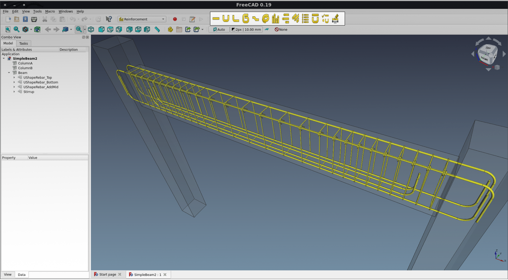

<h1 align="center">Reinforcement workbench for FreeCAD</h1>

<h2 align="center">
<a href="https://lgtm.com/projects/g/amrit3701/FreeCAD-Reinforcement/alerts"></a>
<a href="https://lgtm.com/projects/g/amrit3701/FreeCAD-Reinforcement/context:python"></a>
<a href="https://github.com/psf/black"></a>
<a href="https://github.com/FreeCAD/FreeCAD-addons"></a>
<a href="https://patreon.com/amrit3701"></a>
<a href="https://patreon.com/amrit3701"> </a>
</h2>


This project aims to facilitate flexible implementation and usage of Rebaring in FreeCAD. The Reinforcement workbench provides tools for Reinforcement Generation and Detailing. This workbench provides an interface and presets for the creation of common rebar types. And tools to generate rebars bill of material, rebar shape cut list, bar bending schedule, and rebars drawing and dimension.




---

_Contents:_ **[Installation](#installation)** | **[Features](#features-of-reinforcement-workbench)** | **[Documentation](#documentation)** | **[Contributing](#contributing)** | **[Showcase](#showcase)** | **[Extras](#extras)**

---

## Installation

[](https://github.com/FreeCAD/FreeCAD-addons)

#### Pre-requisites
- FreeCAD (version >= 0.19): [Installation guide](https://www.freecadweb.org/wiki/Installing)
- [Pillow](https://github.com/python-pillow/Pillow): Required for generating BillOfMaterial when working in pure console mode without any gui element
 
### Using Addon Manager
Reinforcement workbench is available through the FreeCAD Addon Manager (menu **Tools → Addon manager**). It is called _Reinforcement_ in the Addon Repository.

### Manual Installation
Like any other FreeCAD [workbench](https://www.freecadweb.org/wiki/Workbench_Concept), you can manually clone or download all the files from this repository in a "Reinforcement" folder inside your FreeCAD Mod directory as described [here](https://github.com/FreeCAD/FreeCAD-addons#2-manual-install).


## Features of Reinforcement workbench

### Reinforcement Generation
- [ **Straight Rebar**](https://wiki.freecadweb.org/Arch_Rebar_Straight): Creates a Straight reinforcement bar in a selected structural element
- [ **UShape Rebar**](https://wiki.freecadweb.org/Arch_Rebar_UShape): Creates a UShape reinforcement bar in a selected structural element 
- [ **LShape Rebar**](https://wiki.freecadweb.org/Arch_Rebar_LShape): Creates a LShape reinforcement bar in a selected structural element
- [ **BentShape Rebar**](https://wiki.freecadweb.org/Arch_Rebar_BentShape): Creates a Bent Shape reinforcement bar in a selected structural element
- [ **Stirrup Rebar**](https://wiki.freecadweb.org/Arch_Rebar_Stirrup): Creates a Stirrup reinforcement bar in a selected structural element
- [ **Helical Rebar**](https://wiki.freecadweb.org/Arch_Rebar_Helical): Creates a Helical reinforcement bar in a selected structural element
- [ **Circular ColumnReinforcement**](https://wiki.freecadweb.org/Arch_Rebar_Circular_ColumnReinforcement): Creates reinforcing bars in a selected circular column structural element
- [ **ColumnReinforcement**](https://wiki.freecadweb.org/Arch_Rebar_ColumnReinforcement): Creates reinforcing bars in a selected rectangular column structural element
- [ **ColumnReinforcement TwoTiesSixRebars**](https://wiki.freecadweb.org/Arch_Rebar_ColumnReinforcement_TwoTiesSixRebars): Creates reinforcing bars in a selected rectangular column structural element
- [ **BeamReinforcement**](https://wiki.freecadweb.org/Arch_Rebar_BeamReinforcement): Creates reinforcing bars in a selected beam structural element

### Reinforcement Detailing

- [ **Bill Of Material**](https://wiki.freecadweb.org/Arch_Rebar_BeamReinforcement): Creates bill of material of reinforcing bars
- [ **Rebar Shape Cut List**](https://wiki.freecadweb.org/Arch_Rebar_BeamReinforcement): Creates rebar shape cut list of reinforcing bars
- [ **Reinforcement Bar Bending Schedule**](https://wiki.freecadweb.org/Arch_Rebar_BeamReinforcement): Creates bar bending schedule of reinforcing bars
- [ **Reinforcement Drawing Dimensioning**](https://wiki.freecadweb.org/Arch_Rebar_Drawing_Dimensioning): Creates drawing and dimensioning of reinforcing bars


## Documentation
The documentation of this workbench is hosted on FreeCAD wiki pages and can be found here: https://wiki.freecadweb.org/Reinforcement_Workbench

[](https://www.youtube.com/watch?v=BYQQjEKmx5E&t=1435s)

## How it works
Each rebar shape tool has two files, one is a `python` (AKA `.py`) file and the second is its respective `UI` (AKA `.ui`) file. For example: ```StraightRebar.py``` and `StraightRebar.ui`. 

Let's continue with the straight rebar shape tool as the example. In the `StraightRebar.py` file, there are two functions:   
1. The `makeStraightRebar()` function, this function creates straight rebar and adds new properties to the default `Rebar` object. 
2. The `editStraightRebar()` function, this function is used when we want to change new properties of the rebar object to take a `Rebar` object as input (which is created by `makeStraightRebar` function). 

Within the `StraightRebar.py` file we find the `_StraightRebarTaskPanel` class present. This class loads the UI (within the `StriaghtRebar.ui` file) in to a FreeCAD task panel. When a user clicks on the `Apply` or the `Ok` button, the `makeStraightRebar` function is executed and after that when the user wants to change the properties of Straight rebar then the `editStraightRebar()` function is executed.


## Contributing
We love contributions! We have collected notes on how to contribute to this project in [CONTRIBUTING.md](https://github.com/amrit3701/FreeCAD-Reinforcement/blob/master/CHANGELOG.md)


## Showcase

| | | |
|:-------------------------:|:-------------------------:|:-------------------------:|
|  **Straight Rebar** |  **UShape Rebar** |  **LShape Rebar** |
|  **BentShape Rebar** |  **Stirrup Rebar** |  <br>**Helical Rebar** |
|  **Circular Column Reinforcement** |  **Single Tie Column Reinforcement** |  **Two Ties Six Rebars Column Reinforcement** |
|  **Beam Reinforcement** |  **Bill Of Material** |  **Rebar Shape Cut List** |
|  **Bar Bending Schedule** |  **Drawing Dimensioning** |


## Extras
This endeavor started as a [Google Summer of Code](https://en.wikipedia.org/wiki/Google_Summer_of_Code) (GSOC 2017) [project](https://summerofcode.withgoogle.com/archive/2017/projects/6536382147198976)

### GSoC 2017
- [FreeCAD forum thread](https://forum.freecadweb.org/viewtopic.php?f=8&t=22760)
- [GSoC proposal](https://brlcad.org/wiki/User:Amritpal_singh/gsoc_proposal)
- [Development logs](https://brlcad.org/wiki/User:Amritpal_singh/GSoC17/logs)

### GSoC 2019
- [FreeCAD forum thread](https://forum.freecadweb.org/viewtopic.php?f=8&t=35077)
- [GSoC proposal](https://www.freecadweb.org/wiki/User:Suraj_Dadral/gsoc_proposal)
- [Development logs](https://www.freecadweb.org/wiki/User:Suraj_Dadral/GSoC19/logs)

### GSoC 2020
- [FreeCAD forum thread](https://forum.freecadweb.org/viewtopic.php?f=23&t=44580)
- [GSoC proposal](https://wiki.freecadweb.org/User:Suraj_Dadral/GSoC20/proposal)
